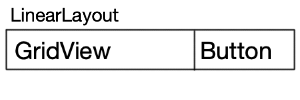

# Android桌面挂件踩坑日记

## 挂件宽高适配问题
在开发过程中发现相同尺寸的挂件在不同机型上的展示大小会有很大差异：
   
如果按照固定尺寸布局，即使使用DP单位在某些机型上也会出现空间不够无法显示完整或者空间太大留白过多的情况。  
我们也参考了其他App开发的挂件，基本都是会有一块区域是可以缩放的，这样在不同机型上展示不会太异常。但是我们的挂件设计因为是先在IOS上开发，没遇到这种不同尺寸兼容的问题，所以设计成这种列表形式，并不能很好的缩放。  
为了兼容不同尺寸，我做了两方面的兼容策略：
1. 父布局使用LinearLayout，每个Item的layout_weight都设为1，均分父布局的高度。这点主要解决了挂件高度过大的问题，扩大列表Item的高度，视觉效果会稍好一点。
2. 根据挂件高度计算最多可以展示多少行内容。主要解决挂件高度不足的问题，直接减少展示内容，避免出现截断的现象。
   ```kotlin
   val canShowItemCount: Int = if (maxHeight > 0) {
        minOf(itemViewIdList.size, (maxHeight - TITLE_HEIGHT) / ITEM_MIN_HEIGHT)
    } else {
        itemViewIdList.size
    }
   ```
   这里介绍一下如何获取挂件的宽高：
   ```kotlin
   override fun onUpdate(context: Context, appWidgetManager: AppWidgetManager,
                          appWidgetIds: IntArray) {
        super.onUpdate(context, appWidgetManager, appWidgetIds)

        val widgetId = appWidgetIds[0]
        val options = appWidgetManager.getAppWidgetOptions(widgetId)
        val maxHeight = options.getInt(AppWidgetManager.OPTION_APPWIDGET_MAX_HEIGHT)
        val maxWidth = options.getInt(AppWidgetManager.OPTION_APPWIDGET_MAX_WIDTH)
        val minWidth = options.getInt(AppWidgetManager.OPTION_APPWIDGET_MIN_WIDTH)
        val minHeight = options.getInt(AppWidgetManager.OPTION_APPWIDGET_MIN_HEIGHT)
    }

    override fun onAppWidgetOptionsChanged(context: Context, appWidgetManager: AppWidgetManager,
                                           appWidgetId: Int, newOptions: Bundle) {
        super.onAppWidgetOptionsChanged(context, appWidgetManager, appWidgetId, newOptions)
        val height = newOptions.getInt(AppWidgetManager.OPTION_APPWIDGET_MAX_HEIGHT)
        val width = newOptions.getInt(AppWidgetManager.OPTION_APPWIDGET_MAX_WIDTH)
    }
   ```
   这里获取到的宽高就是系统给分配的实际宽高，单位是dp；我的兼容策略也是基于获取到的宽高来计算的。但是我们测试发现会偶现宽高获取不到的情况，我也没有查到具体的原因，目前也没有更好的解决方案。
## RemoteViewsService复用问题
AppWidget开发中如果需要使用“Collection View”，如ListView、GridView等，就需要用到RemoteViewsService来更新UI，在RemoteViewsService中会创建RemoteViewsFactory作为Collection View的Adapter。

但我遇到的问题是如果同时存在多个同类型的GridView，想使用相同的RemoteViewsService来更新UI，所有GridView的内容都变成一样的了。

Debug后发现RemoteViewsFactory只创建了一次，导致所有的GridView都共用了同一份数据。

看了一下源码，发现了问题所在：

```kotlin
@Override
public IBinder onBind(Intent intent) {
    synchronized (sLock) {
        Intent.FilterComparison fc = new Intent.FilterComparison(intent);
        RemoteViewsFactory factory = null;
        boolean isCreated = false;
        if (!sRemoteViewFactories.containsKey(fc)) {
            factory = onGetViewFactory(intent);
            sRemoteViewFactories.put(fc, factory);
            factory.onCreate();
            isCreated = false;
        } else {
            factory = sRemoteViewFactories.get(fc);
            isCreated = true;
        }
        return new RemoteViewsFactoryAdapter(factory, isCreated);
    }
}
```
可以看到这里是创建RemoteViewsFactory的关键代码，其中最主要的是会用Intent.FilterComparison为Key从HashMap里获取RemoteViewsFactory。

FilterComparison中重写了equals方法，可以看到主要调用了Intent的filterEquals方法。
```kotlin
@Override
public boolean equals(Object obj) {
    if (obj instanceof FilterComparison) {
        Intent other = ((FilterComparison)obj).mIntent;
        return mIntent.filterEquals(other);
    }
    return false;
}
```

接着来看filterEquals方法，里面判断了Action、Data、Type、Identifier、Package、Component、Categories是否相同来判断两个Intent是否相同。
```kotlin
public boolean filterEquals(Intent other) {
    if (other == null) {
        return false;
    }
    if (!Objects.equals(this.mAction, other.mAction)) return false;
    if (!Objects.equals(this.mData, other.mData)) return false;
    if (!Objects.equals(this.mType, other.mType)) return false;
    if (!Objects.equals(this.mIdentifier, other.mIdentifier)) return false;
    if (!Objects.equals(this.mPackage, other.mPackage)) return false;
    if (!Objects.equals(this.mComponent, other.mComponent)) return false;
    if (!Objects.equals(this.mCategories, other.mCategories)) return false;

    return true;
}
```
分析到这里我们的问题就很清晰了，解决方案就是要在更新不同View时创建不同的Intent。我这里采用了StackOverflow上的一个方法，使用setData来区分不同的Intent：
```kotlin
val intent = Intent(context, MatchWidgetTeamIconService::class.java).apply {
    data = Uri.parse(this.toUri(Intent.URI_INTENT_SCHEME))
}
```

## RemoteViewsFactory异步加载问题
在桌面挂件中使用ListView、GridView等AdapterView的时候，需要实现RemoteViewsFactory作为Adapter处理UI内容的填充。

RemoteViewsFactory的结构和Adapter的结构基本相同：
```kotlin
class MyRemoteAdapter: RemoteViewsService.RemoteViewsFactory{
    override fun onCreate() {
        TODO("Not yet implemented")
    }

    override fun onDataSetChanged() {
        TODO("Not yet implemented")
    }

    override fun onDestroy() {
        TODO("Not yet implemented")
    }

    override fun getCount(): Int {
        TODO("Not yet implemented")
    }

    override fun getViewAt(position: Int): RemoteViews {
        TODO("Not yet implemented")
    }

    override fun getLoadingView(): RemoteViews {
        TODO("Not yet implemented")
    }

    override fun getViewTypeCount(): Int {
        TODO("Not yet implemented")
    }

    override fun getItemId(position: Int): Long {
        TODO("Not yet implemented")
    }

    override fun hasStableIds(): Boolean {
        TODO("Not yet implemented")
    }
}
```
每个接口的具体介绍可以查看官方文档：[RemoteViewsFactory](https://developer.android.com/reference/android/widget/RemoteViewsService.RemoteViewsFactory) 这里不详细介绍。简单来说就是需要在getViewAt方法中构造ItemView。

实际开发过程中，ItemView中的内容经常是需要异步加载的，比如网络图片的下载。在App开发中，我们经常是异步下载完成后再局部刷新View展示，但是我发现在RemoteViewsFactory中并没有触发刷新的方法。

仔细查看官方文档和[官方demo](https://android.googlesource.com/platform/development/+/master/samples/StackWidget/src/com/example/android/stackwidget/StackWidgetService.java)，也并没有发现如何异步加载再触发刷新的方法。另外还发现官方文档中一个容易迷惑开发者的地方：
```java
public void onCreate() {
    // In onCreate() you setup any connections / cursors to your data source. Heavy lifting,
    // for example downloading or creating content etc, should be deferred to onDataSetChanged()
    // or getViewAt(). Taking more than 20 seconds in this call will result in an ANR.
    for (int i = 0; i < mCount; i++) {
        mWidgetItems.add(new WidgetItem(i + "!"));
    }
    // We sleep for 3 seconds here to show how the empty view appears in the interim.
    // The empty view is set in the StackWidgetProvider and should be a sibling of the
    // collection view.
    try {
        Thread.sleep(3000);
    } catch (InterruptedException e) {
        e.printStackTrace();
    }
}
```
只看代码，demo在onCreate中Sleep了3秒，注释说是为了展示Loading状态下的UI。但是这让我误以为可以在onCreate中进行一些耗时操作；后来经过debug发现onCreate是运行在App的主线程中的，如果进行耗时操作，会卡住App的UI，如果耗时过长还会引起ANR。

再仔细看注释中其实已经写了，耗时操作建议放到getViewAt或者onDataSetChanged方法中处理，经过我的实验也发现这两个方法都是执行在子线程中的。

再回到我们异步加载的问题，比如图片的下载，其实就可以以同步的方式在getViewAt方法中进行下载，等所有数据准备完成后再填充到RemoteView中返回即可。

但是我又遇到一个很蛋疼的问题，我们项目中网络图片是用Fresco下载展示的，Fresco直接获取图片的只有一个异步的接口，所以我这里用了一个比较恶心的办法：用同步锁卡住当前线程，等图片下载完成后再解锁继续执行。
```kotlin
val disposable = FrescoImageUtil.getImageObservable(iconUrl)
        .subscribeOn(RxSchedulers.downloadTask())
        .observeOn(RxSchedulers.lightTask()).subscribe({ ref ->
            val bitmap = FrescoImageUtil.getBitmap(ref)
            views.setImageViewBitmap(iconImg, bitmap)
            synchronized(loadingLock) {
                loadingLock.notifyAll()
            }
        }, { e ->
            synchronized(loadingLock) {
                loadingLock.notifyAll()
            }
        })
synchronized(loadingLock) {
    loadingLock.wait()
}
```
这样确实可以成功加载图片了，但是又发现有另外一个问题，就随机会出现某些图片加载不出来，而且概率还比较高。

根据长期解Bug的经验，感觉是这个锁出了问题，仔细Debug发现，问题出在这个**notifyAll**上面。最开始我的loadingLock是一个成员变量，也就是每一次getViewAt里加载图片都是用同一个对象锁住的，这么做是我下意识认为每一次的getViewAt是在同一个线程中顺序执行的；但其实并不是。。打日志发现这里应该是有一个线程池在并行执行，而notifyAll调用的时候会解锁所有用这个对象锁住的线程，所以当一个图片加载完成后，解锁了所有的线程，有些线程中可能图片还没有加载完成。

解决方法就是在每一次getViewAt中创建一个临时变量作为锁的对象来锁住当前加载图片的流程，改动之后问题解决。

## GridView使用问题
在挂件中使用GridView的时候，也遇到了一些问题，这里也一起记录一下。  
我们的UI设计是如下图所示的：  
  
其中Button的宽度是固定值，希望GridView的宽度能够根据item的个数自适应。但是使用中发现GridView一定会占满父布局的全部宽度，甚至会把Button挤出屏幕。  
**解决方法是在LinearLayout中，可以只将GridView的layout_weiget设为1，就不会将Button挤出屏幕了。**  
另外一个问题是我们希望只展示一行，并且占满整个空间。所以我只能通过挂件的宽度去计算一行可以放下多少个Item；然后给GridView设置数据的时候就根据计算出的个数填充数据。但这里还有个关键的问题是如何设置GridView的列数。如果是在App的开发中，我们可以根据计算出的Item个数动态设置GridView的numColumns，但是在挂件中，这个属性是不支持动态设置的。  
好在GridView的**numColumns属性支持一个auto-fit的参数**，设置成这个参数后GridView就会自动计算一行最多可以放下多少个Item。需要注意的是auto-fit参数需要配合columnWidth属性一起使用，要将columnWidth属性设置为每个Item的宽度，否则计算会出现异常，导致最后展示的效果不符合我们的预期。
