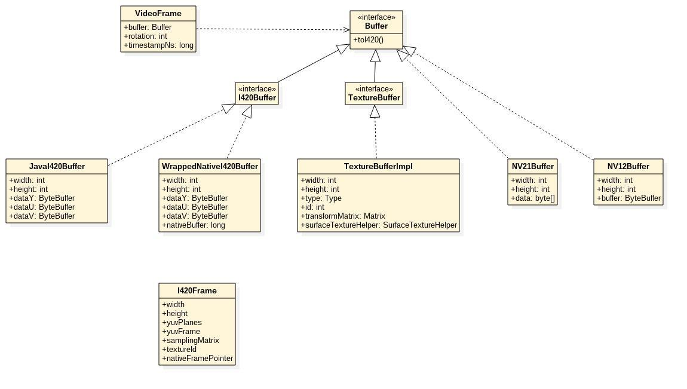
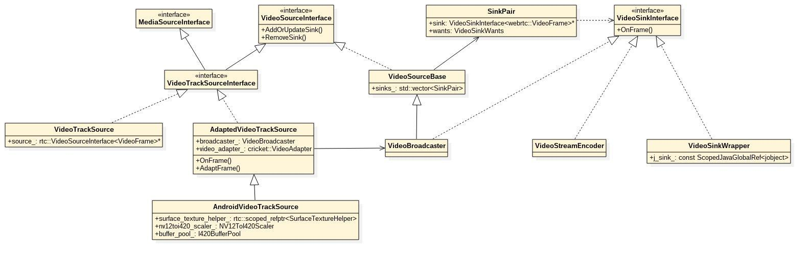

## 视频采集
视频采集接口的使用大致如下：  
```java
VideoCapturer capturer = createVideoCapture()
videoSource = factory.createVideoSource(capturer.isScreencast());
capturer.initialize(surfaceTextureHelper, appContext, videoSource.getCapturerObserver());
capturer.startCapture(videoWidth, videoHeight, videoFps);
```

主要用到了两个类`VideoCapture`和`VideoSource`：  
### VideoCapture

VideoCapture是WebRTC提供的视频采集接口类，开发者可以实现这个接口将采集到的视频帧传递给底层。接口定义如下：  
```java
public interface VideoCapturer {
  
  void initialize(SurfaceTextureHelper surfaceTextureHelper, Context applicationContext,
      CapturerObserver capturerObserver);

  void startCapture(int width, int height, int framerate);

  void stopCapture() throws InterruptedException;

  void changeCaptureFormat(int width, int height, int framerate);

  void dispose();

  boolean isScreencast();
}
```  
官方提供了3个默认的实现：  
* `CameraCapturer` ——采集摄像头数据，又细分为`Camera1Capturer`和`Camera2Capturer`，对应不同的系统摄像头接口
* `FileVideoCapturer` ——采集视频文件数据
* `ScreenCapturerAndroid` ——采集屏幕录制数据

将采集到的数据帧向WebRTC核心传递主要是通过`CapturerObserver`的`onFrameCaptured`接口；开发者获取到视频帧数据后调用`onFrameCaptured`即可将这一帧数据自动发送到远端：  
```java
public interface CapturerObserver {
  /** Notify if the capturer have been started successfully or not. */
  void onCapturerStarted(boolean success);
  /** Notify that the capturer has been stopped. */
  void onCapturerStopped();

  /** Delivers a captured frame. */
  void onFrameCaptured(VideoFrame frame);
}
```
可以看到，`onFrameCaptured`接口需要传递`VideoFrame`类型的帧数据，其中主要是包含了一个`Buffer`：
```java
public class VideoFrame implements RefCounted {
    ...
    private final Buffer buffer;
    private final int rotation;
    private final long timestampNs;
    ...
}
```
`Buffer`也是一个接口类，定义了如视频帧宽、高，裁剪等接口；而数据内容需要转换为I420格式：  

接口定义如下：
```java
public interface Buffer extends RefCounted {
    /**
     * Resolution of the buffer in pixels.
     */
    @CalledByNative("Buffer") int getWidth();
    @CalledByNative("Buffer") int getHeight();

    /**
     * Returns a memory-backed frame in I420 format. If the pixel data is in another format, a
     * conversion will take place. All implementations must provide a fallback to I420 for
     * compatibility with e.g. the internal WebRTC software encoders.
     */
    @CalledByNative("Buffer") I420Buffer toI420();

    @Override @CalledByNative("Buffer") void retain();
    @Override @CalledByNative("Buffer") void release();

    /**
     * Crops a region defined by |cropx|, |cropY|, |cropWidth| and |cropHeight|. Scales it to size
     * |scaleWidth| x |scaleHeight|.
     */
    @CalledByNative("Buffer")
    Buffer cropAndScale(
        int cropX, int cropY, int cropWidth, int cropHeight, int scaleWidth, int scaleHeight);
  }
```

### VideoSource
VideoCapture的核心是调用`CapturerObserver`的`onFrameCaptured`接口传递视频帧数据。而VideoSource主要就是对`CapturerObserver`的实现和对`NativeAndroidVideoTrackSource`的封装。  

VideoSource的创建是通过`PeerConnectionFactory`的静态方法`createVideoSource`，主要是通过JNI接口创建一个`NativeAndroidVideoTrackSource`的实例。具体实现代码在`peer_connection_factory.cc -> JNI_PeerConnectionFactory_CreateVideoSource`。  

视频采集数据的传递过程如下图：  

在VideoBroadcaster中包含一个`std::vector<SinkPair>`，存储了需要分发的sink对象，通过AddOrUpdateSink和RemoveSink函数来添加和删除。    
 

### VideoStreamEncoder
在`VideoBroadcaster`中包含的VideoSink主要是`VideoStreamEncoder`和本地视频预览的渲染类。
`VideoStreamEncoder`是视频编码器，接收原始视频帧数据，输出编码后的流数据。  

首先我们来看下`VideoStreamEncoder`创建的流程，可以看到是在`PeerConnection`调用`SetRemoteDescription`的时候去创建的：  
  
调用链比较长，创建`VideoStreamEncoder`的关键是根据SDP中的m-line去创建对应的解码器。先稍微复习一下SDP的解析过程：  
  
解析过程是将SDP的字符串解析最终生成`JsepSessionDescription`的对象，但真正包含解析后的内容是`SessionDescription`类，解析后的键值对存储在这个类的对象中。  
```c++
class JsepSessionDescription : public SessionDescriptionInterface {
  ...
  private:
    std::unique_ptr<cricket::SessionDescription> description_;
    std::string session_id_;
    std::string session_version_;
    SdpType type_;
    std::vector<JsepCandidateCollection> candidate_collection_;
  ...
}
```
在`SetRemoteContent_w`中，有一点一开始比较迷惑的地方是`send_params`是根据远程的SDP创建的，而`recv_params`是根据本地的SDP创建的（在`SetLocalContent_w`方法中）。  


```c++
bool VideoChannel::SetRemoteContent_w(const MediaContentDescription* content,SdpType type,std::string* error_desc) {
  ...
  
  const VideoContentDescription* video = content->as_video();

  RtpHeaderExtensions rtp_header_extensions =
      GetFilteredRtpHeaderExtensions(video->rtp_header_extensions());

  VideoSendParameters send_params = last_send_params_;
  RtpSendParametersFromMediaDescription(
      video, rtp_header_extensions,
      webrtc::RtpTransceiverDirectionHasRecv(video->direction()), &send_params);
  if (video->conference_mode()) {
    send_params.conference_mode = true;
  }
  send_params.mid = content_name();
  ...

  //匹配send和recv的codec参数，清空初始化标识
  if (type == SdpType::kAnswer || type == SdpType::kPrAnswer) {
    for (auto& send_codec : send_params.codecs) {
      auto* recv_codec = FindMatchingCodec(recv_params.codecs, send_codec);
      if (recv_codec) {
        if (!recv_codec->packetization && send_codec.packetization) {
          send_codec.packetization.reset();
          needs_send_params_update = true;
        } else if (recv_codec->packetization != send_codec.packetization) {
          SafeSetError(
              "Failed to set local answer due to invalid codec packetization "
              "specified in m-section with mid='" +
                  content_name() + "'.",
              error_desc);
          return false;
        }
      }
    }
  }
}
```

接下来在`WebRtcVideoChannel::SetSendParameters`中进行codec的匹配：  
```c++
bool WebRtcVideoChannel::SetSendParameters(const VideoSendParameters& params) {
  ...
  ChangedSendParameters changed_params;
  //匹配获取需要修改的参数
  if (!GetChangedSendParameters(params, &changed_params)) {
    return false;
  }

  //negotiated_codecs中就是对local和remote协商匹配后的codec参数
  if (changed_params.negotiated_codecs) {
    for (const auto& send_codec : *changed_params.negotiated_codecs)
      RTC_LOG(LS_INFO) << "Negotiated codec: " << send_codec.codec.ToString();
  }

  send_params_ = params;
  return ApplyChangedParams(changed_params);
}
```
看到这里会生成一个`negotiated_codecs`列表，里面保存的是所有匹配上的codec参数。但是会将这个队列的第一个codec参数保存在`changed_params`的`send_codec`成员变量里，后续创建编码器就用的是这个参数。  

接下来看一下**编码器与VideoTrack的关联**：  
