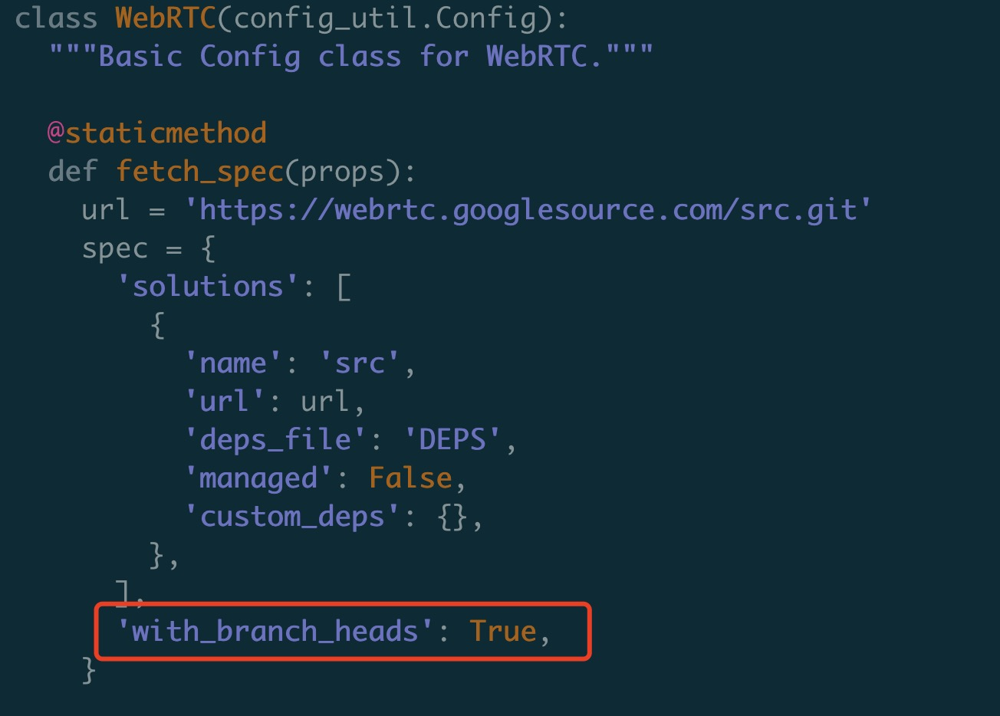
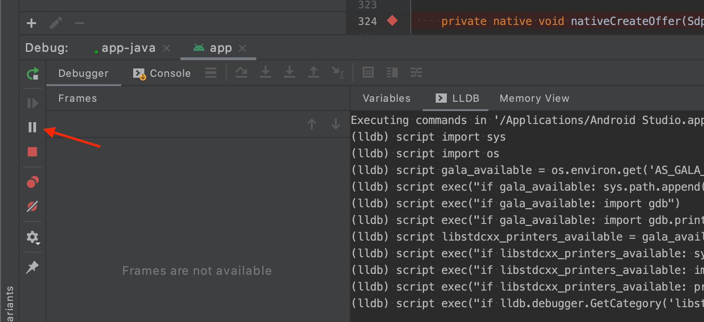
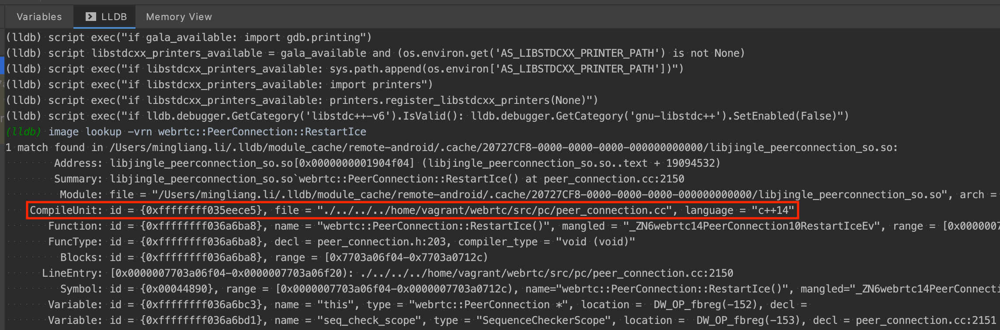
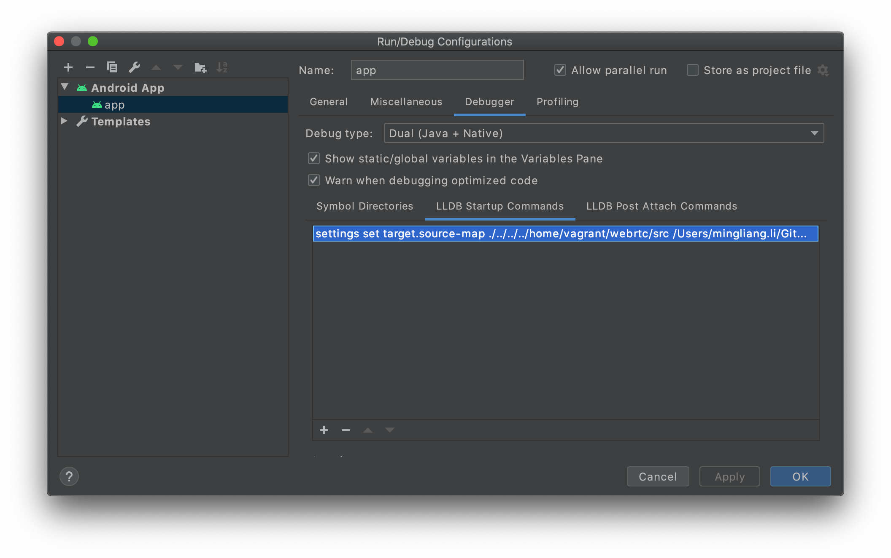

## WebRTC源码Fork
Google的仓库我们显然是没有提交权限的，如果我们想要修改WebRTC的源码，那势必得Fork一份源码到我们自己的Git仓库去。  

这里遇到的第一个问题就是如何跟踪Google仓库的源码更新，我们目前采用的是比较粗暴的Fork方案：即直接将WebRTC的指定分支源码copy一份到我们自己的仓库。  

由于失去了原始Git仓库的信息，在Fork的仓库中是无法跟踪原始仓库的变动更新的。  

### 添加远程仓库
  
当我们从远程仓库Clone一份到本地仓库时，查看当前远程仓库信息：  
```
$ git remote -v
origin	http://git.woa.com/jwkuang/Test-Fork.git (fetch)
origin	http://git.woa.com/jwkuang/Test-Fork.git (push)
```

想要跟踪另一个仓库，首先通过**git remote add**命令来添加远程仓库：  
```
$ git remote add upstream http://git.woa.com/jwkuang/Test-Origin.git
$ git remote -v
origin	http://git.woa.com/jwkuang/Test-Fork.git (fetch)
origin	http://git.woa.com/jwkuang/Test-Fork.git (push)
upstream	http://git.woa.com/jwkuang/Test-Origin.git (fetch)
upstream	http://git.woa.com/jwkuang/Test-Origin.git (push)
```

可以看到我们跟踪的远程仓库中已经添加上了Fork的原始仓库。  

当原始仓库有更新需要Rebase时：
```
$ git fetch upstream
$ git rebase upstream/master
```
## 源码下载调整
标准的webrtc源码下载流程如下：
1. 安装depot_tools，这是一套主要由python脚本组成的工具，chromium相关代码拉取、编译都会用到它
    ```
    git clone https://chromium.googlesource.com/chromium/tools/depot_tools.git
    ```
2. 将depot_tools加入PATH
    ```
    export PATH=$PATH:{path-to-depot_tools}
    ```
3. 拉取webrtc源码及所需依赖源码，这里fetch后面可选平台：webrtc_android、webrtc_ios等
    ```
    mkdir webrtc
    cd webrtc
    fetch --nohooks webrtc
    ```
4. 同步依赖库
    ```
    glicnet sync
    ```

WebRTC的源码其实都在 https://webrtc.googlesource.com/src 这个仓库里，大概200多MB，而通过上面命令下载下来的可编译的完整源码则有10多个G，多出的部分都是编译所需的第三方依赖库。  

### 源码分支问题
在Fork源码的时候，其实我们只需要 https://webrtc.googlesource.com/src 这个仓库里的源码就够了，所以最初我尝试直接clone这个仓库进行拷贝。  

但是发现一个问题，直接clone下来的仓库里只有三个分支：
```
remotes/origin/infra/config
remotes/origin/lkgr
remotes/origin/master
```
但是在chromium的分支信息里WebRTC是有很多稳定版本的 https://chromiumdash.appspot.com/branches   

通过depot_tools拉取下来的完整代码里却有这些分支信息。分析了一下fetch的脚本，可以看到它首先也是去 https://webrtc.googlesource.com/src 仓库拉下来代码，但是在 `fetch_configs/webrtc.py` 里我们看到：
  
这个参数就是控制是否拉取这些稳定版本的分支。但是具体从哪里拉下来暂时还没分析清楚。  

### 源码Fork流程
1. 进入Fork仓库的根目录fetch 和 sync，拉取完整源码
2. 切换到对应分支，目前用的是4240
3. 拷贝src目录下的所有文件到Fork仓库的根目录
4. commit&push。因为webrtc源码工程里已经写好了.gitignore，过滤了所有第三方依赖库的文件，所以这里push到远程仓库的只有 https://webrtc.googlesource.com/src 的核心源码。  

### 修改depot_tools下载
下载完整源码还是需要depot_tools，但是要将下载脚本关联到我们Fork的仓库，需要修改 `fetch_configs/webrtc.py` 里的仓库url，并且将 `with_branch_heads` 改为False。  

再执行fetch的时候就会从我们Fork的仓库下载源码。

## 源码调试方法一——关联源文件
Android下想要调试源码会比较麻烦，网上找到了两种方法来实现调试，第一种是在编译机（ubuntu）上编译出带有符号表和调试信息的so，然后通过LLDB的启动指令替换源码路径。  

### 编译Debug包
首先要避免编译时这些信息被 strip 掉，因此需要修改 Android 平台的编译配置，文件路径参见代码标题：  
`./build/toolchain/android/BUILD.gn`  
```
...
template("android_clang_toolchain") {
  ...
  _prefix = rebase_path("$clang_base_path/bin", root_build_dir)
  cc = "$_prefix/clang"
  cxx = "$_prefix/clang++"
  ar = "$_prefix/llvm-ar"
  ld = cxx
  readelf = _tool_prefix + "readelf"
  nm = _tool_prefix + "nm"
  # 注释掉下面两行配置，即可实现 unstrip
  # strip = rebase_path("//buildtools/third_party/eu-strip/bin/eu-strip",
  #                     root_build_dir)
  # use_unstripped_as_runtime_outputs = android_unstripped_runtime_outputs
  ...
}
...
```
接着我们可以根据 编译源码 进行编译，不过我们需要添加一些 `build_aar.py` 的编译参数：
```
$ ./tools_webrtc/android/build_aar.py \
  --extra-gn-args "is_debug=true symbol_level=2 android_full_debug=true" \
  --arch arm64-v8a
```
这里如果编译armeabi-v7a的包会报错，所以只能编译arm64-v8a平台。  

### Android Studio配置
1. 首先将项目里引入我们自己刚刚编译好的 `libwebrtc.aar`。接着需要在 `app/build.gradle` 中做如下配置：
```
...
android {
  ...
  buildTypes {
    ...
    debug {
      ...
      debuggable true     // 必须设置为 true
      jniDebuggable true  // 必须设置为 true
      minifyEnabled false // 必须设置为 false
    }
  }

  ...
  packagingOptions {
    ...
    // 如果不设置 doNotStrip，编译出来的安装包还是会丢失调试信息；
    // 因为我们只编译了 arm64-v8a 架构的包，所以只需要配置这一行即可
    doNotStrip "*/arm64-v8a/*.so"
  }
}
...
```
2. 查看so中源码路径  
    * 先在 WebRTC Java 层打一个断点，启动 Debugger 并运行到断点处。
    * 切换到 Debugger 的 LLDB 命令行，此时这个 Tab 是不能输入任何命令的。我们需要点击左边的（红色箭头所指的）暂停按钮，让其变为可输入命令的模式：
    
    
    * 输入如下 LLDB 命令并得到输出：
    ```
    # https://stackoverflow.com/a/53065726/4696820
    # 查看 Native 层 webrtc::PeerConnection::RestartIce 这个方法的调试信息；
    # 这里选用 RestartIce 而不是 CreateOffer 作为示例的原因是其输出单一，易于阅读

    (lldb) image lookup -vrn webrtc::PeerConnection::RestartIce
    ```
    
    
    * 看到 CompileUnit 这一行（红框部分），明确指出了 RestartIce 这个方法所处的源码路径。不过显然我们本机的 Android Studio 是无法索引到这个路径的，因为这是编译机里的路径。
    * 假设本机的 WebRTC 源码所在路径为 ~/GitHub/webrtc/src ，则我们需要将 CompileUnit 中的路径前缀 ./../../../home/vagrant/webrtc/src 替换为这个路径。此时可以在 Android Studio Debugger 的 `LLDB Startup Commands` 中添加如下命令：
    ```
    settings set target.source-map ./../../../home/vagrant/webrtc/src /Users/mingliang.li/GitHub/webrtc/src
    ```
    

    * 在Native代码中打断点就可以正确断到了

## Android Studio编译源码
上面的方案其实已经可以进行源码的调试，但是还有一个问题是native源码直接导入Android Studio是没有链接信息，无法进行函数跳转，这让我们学习源码以及后续修改源码很不方便。  

在网上找到一篇讲述怎么用Android Studio编译源码的文章：[macOS 下单步调试 WebRTC Android & iOS](https://blog.piasy.com/2018/08/14/build-webrtc/index.html) 大致方案就是自己编写CMakeLists以及build.gradle将webrtc的native源码和java sdk源码引入，作为一个Library进行编译。  

WebRTC的SDK主要分为两部分：  
1. java API
2. Native实现  

当然在编译之前首先要下载一份完整的webrtc_android源码，并且需要在编译机中编译完成，将编译输出的文件拷贝出来，原因后面介绍。

### Java API
我将Java部分和Native部分分别建了两个Module，在Java的Module里，主要引入Java API相关源码，做法是在`build.gradle`里添加：  
```
sourceSets {
        main {
            java.srcDirs = [
                    "${webrtc_repo}/modules/audio_device/android/java/src",
                    "${webrtc_out_dir}/gen/modules/audio_device/audio_device_java/generated_java",
                    "${webrtc_out_dir}/gen/rtc_base/base_java/generated_java",
                    "${webrtc_out_dir}/gen/sdk/android/audio_api_java/generated_java",
                    "${webrtc_out_dir}/gen/sdk/android/base_java/generated_java",
                    "${webrtc_out_dir}/gen/sdk/android/builtin_audio_codecs_java/generated_java",
                    "${webrtc_out_dir}/gen/sdk/android/camera_java/generated_java",
                    "${webrtc_out_dir}/gen/sdk/android/default_video_codec_factory_java/generated_java",
                    "${webrtc_out_dir}/gen/sdk/android/filevideo_java/generated_java",
                    "${webrtc_out_dir}/gen/sdk/android/hwcodecs_java/generated_java",
                    "${webrtc_out_dir}/gen/sdk/android/java_audio_device_module_java/generated_java",
                    "${webrtc_out_dir}/gen/sdk/android/libjingle_peerconnection_java/generated_java",
                    "${webrtc_out_dir}/gen/sdk/android/libjingle_peerconnection_metrics_default_java/generated_java",
                    "${webrtc_out_dir}/gen/sdk/android/libvpx_vp8_java/generated_java",
                    "${webrtc_out_dir}/gen/sdk/android/libvpx_vp9_java/generated_java",
                    "${webrtc_out_dir}/gen/sdk/android/logging_java/generated_java",
                    "${webrtc_out_dir}/gen/sdk/android/peerconnection_java/generated_java",
                    "${webrtc_out_dir}/gen/sdk/android/screencapturer_java/generated_java",
                    "${webrtc_out_dir}/gen/sdk/android/surfaceviewrenderer_java/generated_java",
                    "${webrtc_out_dir}/gen/sdk/android/swcodecs_java/generated_java",
                    "${webrtc_out_dir}/gen/sdk/android/video_api_java/generated_java",
                    "${webrtc_out_dir}/gen/sdk/android/video_java/generated_java",
                    "${webrtc_repo}/rtc_base/java/src",
                    "${webrtc_repo}/sdk/android/api",
                    "${webrtc_repo}/sdk/android/src/java"
            ]
            java.filter.exclude([
                    "org/webrtc/audio/LegacyAudioDeviceModule.java"
            ])
        }
    }
```

并且在dependencies中引用编译so的Module：  
```
dependencies {
    implementation 'androidx.annotation:annotation:1.2.0'
    implementation project(':libjingle_peerconnection')
}
```

这里遇到一个比较坑的问题是我们Demo工程里使用了androidx，webrtc源码中的 `annotation` 库的引用需要全部替换为 `androidx.annotation`  

### 编译libjingle_peerconnection.so
最麻烦的部分就是Native代码的编译，Google使用的是他们自己开发的GN+Ninja构建系统，但最后其实都是使用cmake进行编译。所以网上有人通过分析webrtc的编译脚本将所需的源文件和头文件写成CMakeLists，就可以通过Android Studio进行源码编译。  

网上找到的编译脚本需要根据源码版本的不同进行一些调整。  

前面说到需要将编译完成后的输出文件拷贝出来，这里主要的原因是JNI文件的生成是在编译过程里进行的。  

我一开始看源码的时候就发现Java API源码中的native方法在源码中找不到对应的JNI方法，后来才知道他是通过python脚本生成的JNI接口头文件。  

从生成的头文件中可以看到：  
```
// This file is autogenerated by
//     base/android/jni_generator/jni_generator.py
// For
//     org/webrtc/VideoTrack
```

指明了生成JNI脚本的位置，具体它是如何生成JNI文件的，还没有仔细去研究。  

在webrtc的所有 `BUILD.gn` 中，所有 `generate_jni` 都是生成JNI的任务，理论上也可以单独将这些任务执行一遍生成JNI头文件。  

