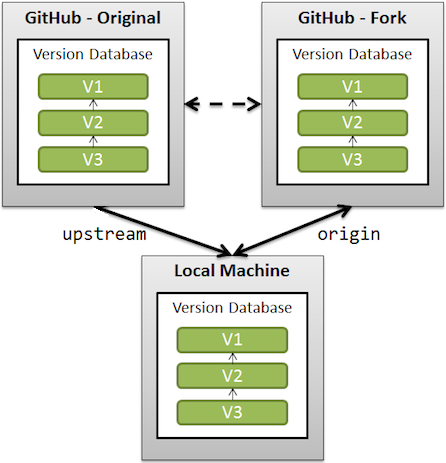

## WebRTC源码Fork
Google的仓库我们显然是没有提交权限的，如果我们想要修改WebRTC的源码，那势必得Fork一份源码到我们自己的Git仓库去。  

这里遇到的第一个问题就是如何跟踪Google仓库的源码更新，我们目前采用的是比较粗暴的Fork方案：即直接将WebRTC的指定分支源码copy一份到我们自己的仓库。  

由于失去了原始Git仓库的信息，在Fork的仓库中是无法跟踪原始仓库的变动更新的。  

### 添加远程仓库
  
当我们从远程仓库Clone一份到本地仓库时，查看当前远程仓库信息：  
```
$ git remote -v
origin	http://git.woa.com/jwkuang/Test-Fork.git (fetch)
origin	http://git.woa.com/jwkuang/Test-Fork.git (push)
```

想要跟踪另一个仓库，首先通过**git remote add**命令来添加远程仓库：  
```
$ git remote add upstream http://git.woa.com/jwkuang/Test-Origin.git
$ git remote -v
origin	http://git.woa.com/jwkuang/Test-Fork.git (fetch)
origin	http://git.woa.com/jwkuang/Test-Fork.git (push)
upstream	http://git.woa.com/jwkuang/Test-Origin.git (fetch)
upstream	http://git.woa.com/jwkuang/Test-Origin.git (push)
```

可以看到我们跟踪的远程仓库中已经添加上了Fork的原始仓库。  

当原始仓库有更新需要Rebase时：
```
$ git fetch upstream
$ git rebase upstream/master
```
## 源码下载调整
标准的webrtc源码下载流程如下：
1. 安装depot_tools，这是一套主要由python脚本组成的工具，chromium相关代码拉取、编译都会用到它
    ```
    git clone https://chromium.googlesource.com/chromium/tools/depot_tools.git
    ```
2. 将depot_tools加入PATH
    ```
    export PATH=$PATH:{path-to-depot_tools}
    ```
3. 拉取webrtc源码及所需依赖源码，这里fetch后面可选平台：webrtc_android、webrtc_ios等
    ```
    mkdir webrtc
    cd webrtc
    fetch --nohooks webrtc
    ```
4. 同步依赖库
    ```
    glicnet sync
    ```

WebRTC的源码其实都在 https://webrtc.googlesource.com/src 这个仓库里，大概200多MB，而通过上面命令下载下来的可编译的完整源码则有10多个G，多出的部分都是编译所需的第三方依赖库。  

### 源码分支问题
在Fork源码的时候，其实我们只需要 https://webrtc.googlesource.com/src 这个仓库里的源码就够了，所以最初我尝试直接clone这个仓库进行拷贝。  

但是发现一个问题，直接clone下来的仓库里只有三个分支：
```
remotes/origin/infra/config
remotes/origin/lkgr
remotes/origin/master
```
但是在chromium的分支信息里WebRTC是有很多稳定版本的 https://chromiumdash.appspot.com/branches 
## 源码调试方法一——关联源文件

## Android Studio编译源码